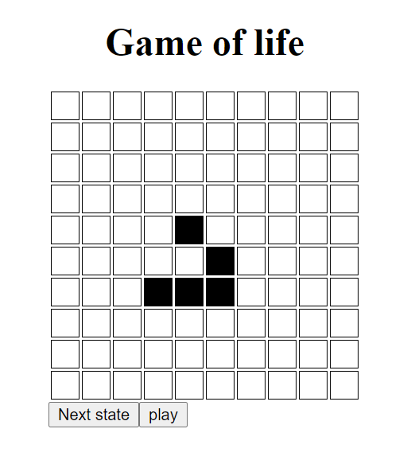

# Game of life
The Game of Life, is a cellular automaton devised by John Horton Conway in 1970. It is a zero-player game, meaning that its evolution is determined by its initial state, requiring no further input. 
I have this implementation of by using Javascript and ReactJS to visualize it. 



## Features
- Click the grid to make the intial state
- Gradually step through the evolutions
- Play the evolution and see how it grows

## How to use
- ```git clone https://github.com/andersbjorklundjensen/game-of-life game-of-life```
- ```cd game-of-life```
- ```npm install```
- ```npm start```